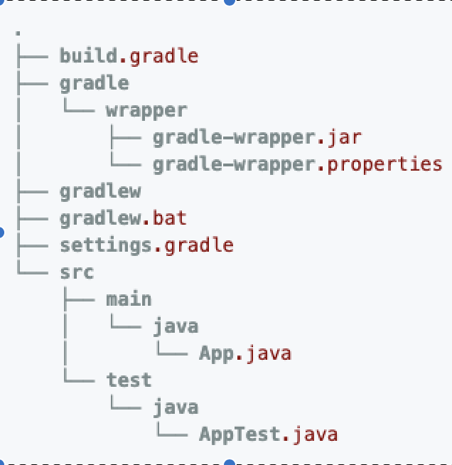

Gradle 철저 입문
--

### Task - Hello World

#### 1. 태스크 생성
- **build.gradle**
```groovy
task helloWorld {
    println 'Hello World'
}
```
- **run task**
```bash
$ gradle helloWorld

> Configure project :
:helloWorld
Hello World

BUILD SUCCESSFUL
Total time: xx.xx secs
```

#### 2. 내장 태스크
빌드 스크립트에 아무것도 작성하지 않아도 사용할 수 있는 태스크  

- 현재 사용 가능한 태스크의 확인
```bash
$ gradle tasks
```
플러그인을 추가하면 해당 플러그인의 태스크들도 추가된다.  
추가한 플러그인의 태스크들이 궁금할때에도 위 명령어를 입력해보면 된다.

- 빌드 스크립트에 정의된 속성 목록의 확인
```bash
$ gradle properties
```

#### 3. 로깅 명령줄 옵션
디버깅이 필요할때는 명령줄 옵션으로 로그를 추가 할 수 있다.

- **-i(--info) :** INFO 레벨의 로그, 빌드 스크립트의 파일명 등이 출력
- **-s(--stacktrace) :** 예외 발생 시 사용자 예외 부분만 Stack Trace 한다.
- **-S(--full-stacktrace) :** 모든 부분을 Stack Trace 한다. 사용자 예외가 아닌 gradle에 문제가 발생했을때 사용한다.
- **-d(--debug) :** DEBUG 레벨의 로그, Stack Trace 를 포함한 매우 상세한 정보가 출력된다.

---
### 프로젝트 자동화와 빌드

#### 1. init 을 이용한 프로젝트 자동 생성
Gradle은 규칙 기반 빌드 방식이다. 프로젝트를 디렉터리 구조 규칙에 맞게 작성하면 빌드 스크립트를 크게 줄일 수있다.  
내장 태스크 init 을 사용하면 손쉽게 디렉터리 구조를 만들 수 있다.

```bash
$ mkdir java_project
$ cd java_project

$ gradle init --type java-library
```
를 실행하면 아래와 같은 프로젝트 구조가 생성된다.



#### 2. build.gradle 훑어보기

```groovy
    plugins {
        id 'java' // (1) java plugin 을 사용한다.
    }
    
    group 'org.example'
    version '1.0-SNAPSHOT'
    
    repositories {
        mavenCentral() // (2) 의존성 해결을 위해 maven 중앙 저장소를 사용한다.
    }
    
    dependencies { // (3) 의존 라이브러리 설정
                   // Implementation -> 프로젝트 의존성 testImplementation -> 테스트의 의존성
        testImplementation 'org.junit.jupiter:junit-jupiter-api:5.7.0'
        testRuntimeOnly 'org.junit.jupiter:junit-jupiter-engine:5.7.0'
    }
    
    test {
        useJUnitPlatform()
    }
    
    task helloWorld {
        println('Hello World')
    }
```

#### 3. 빌드
- **빌드**
```bash
$ gradle build

> Task :compileJava NO-SOURCE

> Task :processResources NO-SOURCE

> Task :classes UP-TO-DATE

> Task :jar UP-TO-DATE

> Task :assemble UP-TO-DATE

> Task :compileTestJava NO-SOURCE

> Task :processTestResources NO-SOURCE

> Task :testClasses UP-TO-DATE

> Task :test NO-SOURCE

> Task :check UP-TO-DATE

> Task :build UP-TO-DATE

BUILD SUCCESSFUL in 4s
```
build 안에는 많은 Task 들이 포함되어 있다.  
하지만 gradle 은 이전 빌드와 프로젝트의 변경상태를 확인하여 불필요한 Task 는 실행을 생략한다.

- **빌드 실행 결과 제거**
```bash
$ gradle clean
```
clean 을 하면 build 디렉터리에 생성된 빌드 결과들을 제거한다.

- **테스트 실행과 결과 확인**  
위에서 알 수 있듯 빌드 태스크를 실행하면 test 태스크도 함께 실행된다.  
---
### Gradle 의 편리한 기능
#### 1. 데몬
빌드나 명령을 반복해야할때 Gradle 을 jvm을 데몬으로 상주시켜 빌드 속도를 향상시킬 수 있다.

사용은 --daemon 옵션을 주기만 하면 된다.
```bash
$ gradle --daemon helloWorld
```
시간이 지나면 데몬은 자동으로 종료되지만 명시적으로 종료시킬수도 있다.
```bash
$ gradle --stop
```

#### 2. 래퍼
gradle은 설치하지 않아도 래퍼 파일을 통해 프로젝트를 빌드하거나 명령을 실행할 수 있다.
```bash
$ gradle wrapper
```
위 명령어를 실행하면, 여러 파일들이 생성된다
- **gradle/wrapper/gradle-wrapper.jar** 그래이들 래퍼의 부트 스트랩
- **gradle/wrapper/gradle-wrapper.properties** 그래이들 래퍼의 설정 파일
- **gradlew** 그래이들 래퍼의 실행 셸 스크립트  

한명이 래퍼 파일만 생성하여 원격 저장소에서 내려받으면 나머지는 구성원들은  
gradlew 만 실행하면 그레이들의 바이너리가 자동으로 받아져 빌드 스크립트가 실행된다.


